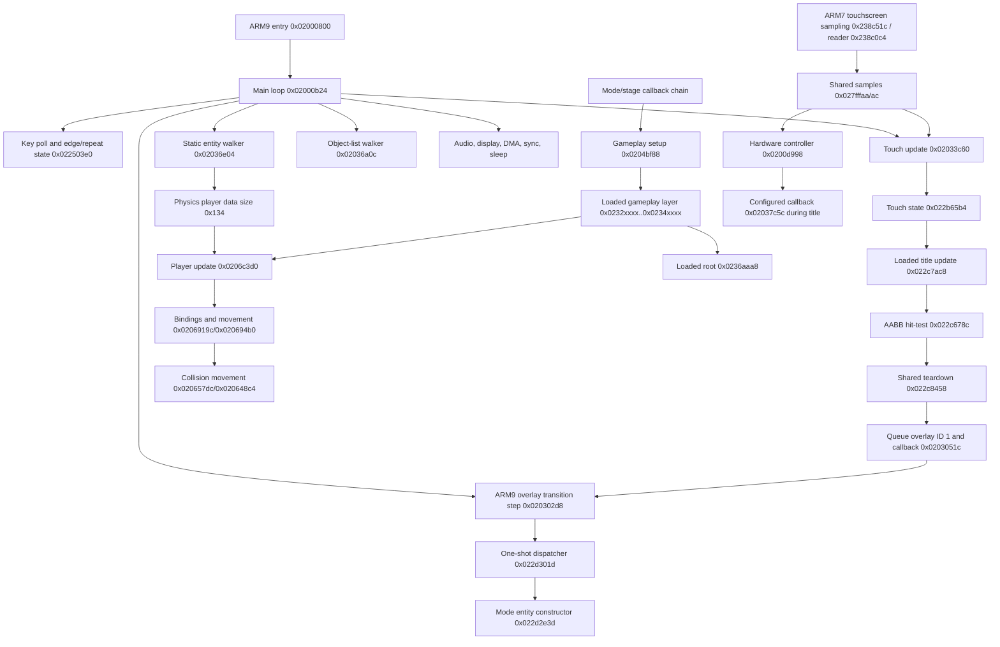

# Sonic Rush Decompilation Project Handoff

**Last updated:** 2026-09-13  
**Branch:** `main`  
**HEAD when written:** Current session (ndsrecomp integration, data table extraction, ROM function decompilation)  
**Primary analysis log:** [`re-analysis.md`](re-analysis.md)

This document is the authoritative continuation point for the project. `re-analysis.md` is a chronological notebook and contains much more instruction-level detail, but older entries may reflect superseded interpretations. When this handoff conflicts with an older note, use this handoff and the newest dated evidence.

## 1. Executive status

This repository is a reverse-engineering workspace with substantial source-level decompilation and build infrastructure.

Current strengths:

- **516/516 source files compile clean** with ARM GCC cross-compiler
- **0 unresolved symbols** in partial link
- **107KB of decompiled code** (.text section)
- **1033 code functions** identified in ROM with function_table.json
- **512 functions named** (49.6% coverage) across all subsystems
- **4 data tables** extracted from ROM (sin, slope, drift, accel)
- **ndsrecomp.json** created for PC recompilation integration
- The fixed ARM9 main loop is identified
- The static entity system, physics player, input, movement, collision, action objects, stage flow, HUD/pause, and object-loader dispatch are substantially mapped
- A selected loaded gameplay dispatcher/spawner chain is mapped from runtime RAM dumps
- 1,670 fixed-ARM9 extraction pairs under `disassembly/`; their ARMIPS harnesses are intended to reassemble byte-exactly
- `tools/hdrv.cpp` provides reproducible headless DeSmuME frame stepping, input injection, CSV telemetry, screenshots, and RAM dumps
- `scripts/title-to-gameplay.txt` reproducibly enters Leaf Storm Zone 1 Act 1 through the interactive title menu
- The title-menu touchscreen consumer and its shared teardown/post-transition chain have now been identified in loaded RAM

Not yet present:

- Byte-matching C/C++ source (semantic matching accepted)
- A linker map or overlay build model matching NDS ROM structure
- A rebuilt ROM target
- Automated matching tests or CI
- A formal symbol/struct database
- Git remote (deferred until Gitea server at 192.168.0.18 is running)
- A complete ARM7 analysis.

### Critical correction made in the current work

`0x022b65b4` is **not** a general game-state dispatcher. It is a 0x28-byte touchscreen coordinate-history and edge-state structure.

The loaded title update at `0x022c7ac8` directly consumes this structure and calls AABB hit-test `0x022c678c`. The previously proposed route through a dynamically installed callback at `0x0207f02c` is disproved: during the title interaction that callback remains the static no-op `0x02037c5c`, and the optional table pointer remains null.

## 2. Evidence and naming conventions

### 2.1 Evidence tags

Use these tags in future notes and source annotations:

| Tag | Meaning |
|---|---|
| **CONFIRMED-STATIC** | Direct instruction, literal, call, or data-flow evidence. |
| **CONFIRMED-RUNTIME** | Observed in a controlled emulator run with a known frame/input scenario. |
| **BYTE-EXACT** | Extracted fixed-ROM bytes reassembled and compared equal to the source ROM. |
| **INFERRED** | Strong structural interpretation that is not fully runtime-verified. |
| **HYPOTHESIS** | Candidate interpretation requiring more evidence. |
| **SUPERSEDED** | Older interpretation invalidated by newer evidence. |

A runtime claim should record the ROM hash, emulator version, frame range, input script, game/overlay phase, and preserved output or dump.

### 2.2 Address and symbol style

Normalize addresses to eight hexadecimal digits, for example `0x02033c60`.

Existing analyzer labels:

- `fcn.020xxxxx`: radare2 function label.
- `aav.0x020xxxxx`: analyzer-created address/value label; do not assume this means a different semantic category.
- Raw addresses are used when there is no stable semantic alias.

Recommended style:

```text
TouchState_Update (0x02033c60, provisional semantic name)
Player_Update (0x0206c3d0, confirmed callback)
TitleMenu_Update (0x022c7ac8, runtime-loaded)
```

Keep the address in every semantic name until a shared symbol map exists. Do not promote a guessed subsystem name to an unqualified fact; the former `StateDispatcher` label for `0x02033c60` is the example to avoid.

### 2.3 Address domains

| Range/domain | Meaning |
|---|---|
| `0x02000000..0x02086898` | Fixed ARM9 image from the ROM. |
| `0x022cxxxx` in the captured title run | Runtime-loaded title/menu overlay code and data. |
| `0x0232xxxx..0x0234xxxx` in gameplay captures | Runtime-loaded gameplay code. |
| `0x0236xxxx` | Runtime globals/data used by the loaded gameplay layer. |
| `0x02380000..0x023a6f24` | ARM7 image. |
| `0x027ffxxx` | Shared/high RAM hardware and ARM7-to-ARM9 communication area. |

Loaded addresses are phase-dependent. A byte dump from gameplay must not be treated as the title overlay at the same address without comparing provenance.

## 3. ROM identity and memory layout

The analyzed ROM is intentionally excluded by `.gitignore`.

| Property | Value |
|---|---|
| Local file | `games/Sonic Rush (USA) (En,Ja,Fr,De,Es,It).nds` |
| Internal title | `SONIC RUSH` |
| Game code | `ASCE` |
| Maker code | `8P` |
| Region/version | USA, revision 0 |
| SHA-256 | `9fb3c797f08fd69d7f52f1266d2f0ab6c37727a3b4e808910d5d5a9599b26986` |
| ARM9 ROM offset | `0x00004000` |
| ARM9 RAM base | `0x02000000` |
| ARM9 entry | `0x02000800` |
| ARM9 size | `0x00086898` (551,064 bytes) |
| ARM9 end | `0x02086898` |
| ARM7 ROM offset | `0x00188000` |
| ARM7 RAM base/entry | `0x02380000` |
| ARM7 size | `0x00026f24` |
| ARM7 end | `0x023a6f24` |

The old ARM9 end value `0x023b748` was erroneous and has been corrected in the analysis log.

## 4. High-level architecture



The IRQ6/controller subsystem is hardware-adjacent and participates in sample/DMA machinery, but current evidence does not support a dynamic callback handoff into the title overlay.

## 5. Confirmed fixed ARM9 systems

### 5.1 Boot and main loop

**CONFIRMED-STATIC**

- Boot entry: `0x02000800`.
- Initialization chain includes `0x0202fcc8 -> 0x02000afc -> 0x0202fcdc`.
- Final transfer enters `0x02000b24`, which does not return.
- `0x02000b24` is the infinite per-frame main loop.

Per-frame outline:

```text
0x02000b24
  -> initialization/state checks
  -> read keypad hardware/shared state
  -> 0x02035134 keypad edge/repeat update
  -> 0x02033c60 touchscreen history/edge update
  -> subsystem updates
  -> 0x020302d8 ARM9 overlay transition and one-shot callback step
  -> 0x02036e04 static entity-list traversal
  -> 0x02036a0c(0) and 0x02036a0c(1) object-list traversal
  -> power/VBlank/flash/synchronization work
  -> SWI sleep
```

### 5.2 Keypad input

**CONFIRMED-STATIC**

Hardware expression observed in the main loop:

```text
keys = (KEYCNT/shared @ 0x027fffa8 | KEYINPUT @ 0x04000130) ^ 0x2fff
keys &= 0x2fff
```

Key state base: `0x022503e0`.

| Offset | Meaning |
|---|---|
| `+0x00` | Current key mask. |
| `+0x02` | Previous mask. |
| `+0x04` | Pressed edges (`current & ~previous`). |
| `+0x06` | Released edges (`~current & previous`). |
| `+0x08` | Held/auto-repeat mask. |
| `+0x0a + bit*2` | Per-key running repeat timers. |
| `+0x22 + bit*2` | Initial repeat delays. |
| `+0x3a + bit*2` | Repeat reload values. |

- Processor: `0x02035134`.
- Initializer: `0x020351d8`.
- Default initial repeat delay: `0x14` frames.

### 5.3 Touchscreen input

**CONFIRMED-STATIC + CONFIRMED-RUNTIME**

Shared ARM7-facing observations:

```text
0x027fffaa  raw touch X in 12.4 fixed point
0x027fffac  packed Y/status
```

Examples:

- `x=128 -> 0x0800` at `0x027fffaa`.
- `x=64 -> 0x0400`.
- `y=60 -> 0xc13c` at `0x027fffac`.
- `y=128 -> 0xc180`.
- Idle sample observed as `0xc600`.

The ARM7 writer is `0x238c51c` (calls shared reader `0x238c0c4`, then `strh`
X -> `0x027fffaa` and packed Y -> `0x027fffac`); the touchscreen case-0
handler `0x238c594` also writes both shared halfwords (see re-analysis item 32).

Touch state base: `0x022b65b4`, size `0x28`.

| Offset | Confirmed/provisional meaning |
|---|---|
| `+0x00/+0x02` | Current X/Y, stored as coordinate + 1; `0xffff` idle. |
| `+0x04/+0x06` | Previous X/Y. |
| `+0x08/+0x0a` | Accepted/press X/Y consumed by title code. |
| `+0x0c/+0x0e` | Release/older X/Y history. |
| `+0x10` | Flags. |
| `+0x14` | Sample-history count/enable byte; observed as 1. |
| `+0x16...` | Optional coordinate-history entries. |

Flag evidence at `+0x10`:

| Bit | Meaning/confidence |
|---|---|
| `0x001` | Update enabled. Confirmed statically. |
| `0x002` | Alternate controller/table path. Confirmed as dispatch selector. |
| `0x010` | Current contact/internal active state. Strong static/runtime evidence. |
| `0x020` | Previous-contact/held state. Strong runtime sequence; exact wording provisional. |
| `0x040` | Press edge. Confirmed by title consumer and runtime. |
| `0x080` | Release edge. Confirmed by handler behavior and runtime sequence. |
| `0x100` | Error/out-of-range/status condition. Unresolved. |

A two-frame tap at requested `(128,60)` produced:

| Frame | `+0/+2` | `+4/+6` | `+8/+a` | `+c/+e` | Flags |
|---|---|---|---|---|---|
| 1199 | `ffff,ffff` | `ffff,ffff` | `0000,0000` | `0000,0000` | `0x01` |
| 1200 | `0081,003d` | `ffff,ffff` | `0081,003d` | `ffff,ffff` | `0x51` |
| 1201 | `0081,003d` | `0081,003d` | `0081,003d` | `ffff,ffff` | `0x31` |
| 1202 | `ffff,ffff` | `0081,003d` | `0081,003d` | `0081,003d` | `0xa1` |
| 1203 | `ffff,ffff` | `ffff,ffff` | `0081,003d` | `0081,003d` | `0x01` |

Static handlers:

- `0x02033c60`: enabled/alternate-path dispatcher.
- `0x0203387c`: alternate table/index sample and edge updater.
- `0x02033a8c`: direct polling sample and edge updater.
- `0x02033cac`: disable/clear path.
- `0x02033d40`: clears enable and history count.
- `0x02033d60`: resets/enables touch state and adjacent storage.
- `0x02033de8`: subsystem initialization.
- Sampler `0x02009998` reads shared `0x027fffaa/ac` into the controller ring
  (`0x207f02c` `+0xc` index / `+0x10` table / `+0x14` limit).
- Adjacent `0x022b658c`, size `0x28`, contains 8-byte sample entries for the alternate path; exact ownership is unresolved.
- **Address-correction note**: earlier analysis used the `0x2037xxx` family
  (dispatcher `0x2037c60`, handlers `0x20378c`/`0x2037a8c`, init `0x2037de8`)
  and `0x200dxxx` controller helpers (`0x200d544`, `0x200d6f0`, ...). Those
  were wrong; the real family is `0x2033xxx` + helpers `0x2009xxx`
  (re-analysis item 32).

### 5.4 Static entity system

**CONFIRMED-STATIC**

Global list root: `0x022b4574`.

Entity container size: `0x1c`.

| Offset | Meaning |
|---|---|
| `+0x00` | Previous/list link. |
| `+0x04` | Next link. |
| `+0x08` | Update callback. |
| `+0x0c` | Destroy callback. |
| `+0x10` | Entity data pointer. |
| `+0x14` | Flags; bit0 skips update. |
| `+0x16` | Type/phase/priority; low 3 bits used in update gating, bit4 can force update. |
| `+0x18` | Size/capacity field. |
| `+0x1a` | Marker, commonly `0xffff`. |

Key functions:

- `0x02036e9c`: container slot allocator; cap `0x100`.
- `0x02037480`: list/container initialization.
- `0x020372d0`: generic entity allocator/constructor.
- `0x02036e04`: per-frame linked-list walker; invokes `[container+8]`.
- `0x020371c8`: entity removal used by multiple callbacks.

`0x020372d0` allocates the data block, records update/destroy callbacks and type, and is used for both the `0x134` physics player and unrelated larger controller entities.

### 5.5 Physics player and per-frame flow

**CONFIRMED-STATIC; selected fields CONFIRMED-RUNTIME**

- Spawn: `0x0204da44`.
- Data size: `0x134`.
- Update callback: `0x0206c3d0`.
- Destroy callback: `0x0206bef4`.
- Movement iterator: `0x0206bd5c`.
- Velocity/binding injection: `0x0206919c`.
- Acceleration/gravity: `0x020694b0`.
- Collision movement: `0x020657dc`.
- Ground/slope resolution: `0x020648c4`.

End-to-end update chain:

```text
0x02036e04
  -> callback 0x0206c3d0
     -> 0x0206919c binding velocity injection
     -> 0x020694b0 acceleration/gravity/rotation
     -> action timer/callback dispatch
     -> 0x0206bd5c stepped movement
        -> 0x02065f98 -> 0x02065ee0
           -> 0x020657dc movement/collision
```

Important player data fields:

| Offset | Meaning |
|---|---|
| `+0x10/+0x14/+0x18` | Position X/Y/Z, 8:8 fixed. |
| `+0x1c/+0x20/+0x24` | Movement targets. |
| `+0x28/+0x2a/+0x2c` | Input velocity X/Y/Z. |
| `+0x2e/+0x30` | Applied velocity X/Y. |
| `+0x34` | Extra/impact velocity. |
| `+0x36/+0x38/+0x3a` | Per-frame raw input scratch. |
| `+0x3c/+0x3e` | Slope/rotated acceleration source. |
| `+0x40` | Gravity. |
| `+0x42` | Terminal/fall velocity clamp. |
| `+0x48` | Acceleration/transport clamp. |
| `+0x4a/+0x4c` | AABB offsets. |
| `+0x4e/+0x50/+0x52` | Saved velocity history. |
| `+0x54` | Control flags. |
| `+0x58` | Physics/state flags. |
| `+0x5c` | Status flags. |
| `+0x5e/+0x60` | Angle history. |
| `+0x62` | Action timer with independent low/high nibble roles. |
| `+0x64..+0x67` | Signed collision margins L/R/T/B. |
| `+0x68/+0x6c/+0x70` | Action callbacks. |
| `+0x78/+0x7c` | Miscellaneous callbacks. |
| `+0x80` | Platform/spring object binding. |
| `+0x84` | Partner binding. |
| `+0x88` | Partner/object reference. |
| `+0x8c` | Action-data pointer. |
| `+0x94/+0xdc` | Hitbox groups. |
| `+0xa4` | Hitbox-link callback. |
| `+0x124/+0x128/+0x12c` | Action-state object slots A/B/C. |
| `+0x130` | Mover-controller binding; not the d-pad source. |

Selected flag meanings:

- `+0x54 bit 0x04`: busy/dead path in update logic.
- `+0x54 bit 0x20`: pause eligibility/gating context.
- `+0x58 bit 0x01`: grounded.
- `+0x58 bit 0x02`: contact this frame.
- `+0x58 bit 0x100`: spawning/airborne-related path depending context.
- `+0x58 bit 0x2000`: movement gate/frozen state.
- `+0x58 bit 0x4000`: collision velocity-kill guard.
- Other `+0x54/+0x58/+0x5c` bits remain provisional and must be named by behavior, not guessed terminology.

Action timer `+0x62`:

- Low nibble decrements one per frame and gates `+0x68` callback execution.
- High nibble decrements by `0x10` and indexes signed drift bytes at `0x02077944`.

Runtime physics evidence from the attract demo:

- Ground acceleration changed velocity by approximately `0x18` per frame.
- Active airborne gravity values included `0x002a`; other action contexts used `0x0008` and `0x0054`.
- Terminal field observed as `0x0220` in a jump context and `0x0f00` in fall context.
- The terminal clamp exists statically at `0x020695c4`, but the captured demo did not reach it (`~0x04ac < 0x0f00`).

### 5.6 Collision

**CONFIRMED-STATIC**

```text
0x020657dc movement/collision resolution
  -> 0x02066010 collision dispatcher
       -> 0x02066638 tile raycast
       -> 0x02067670 entity AABB sweep
       -> 0x020670bc sloped-surface response
            -> 0x02066bc0 slope handler
```

Important data:

- Camera bounds: `0x022c4dcc` (`left/top/right/bottom`).
- Collision entity list/array: `0x022c4e64`.
- Collision entity count: `0x022c4ddc`.
- Ground/slope table: `0x0206e470`.
- Tile stepping uses 8-pixel increments.
- Ground probe distance is `0x18` pixels.
- Ground snap/reject boundary includes `-14`.

### 5.7 Object-list and tile placement systems

**CONFIRMED-STATIC**

Two object-list bases:

- Primary: `0x0208922c`.
- Secondary: `0x02087d04`.
- Selected through table `0x02072c78[arg]`.

Key functions:

- `0x02036a0c`: per-frame list walker/reset.
- `0x02036bfc`: object insertion.
- `0x02036aec`: camera-space coordinate lookup.
- `0x0206aa38`: main tile-object placement builder.
- `0x0206b244`: sibling/secondary builder.
- `0x0206b768`: placement dispatcher.
- `0x0206bd24`: player hitbox/tile placement link.

Known relative layout is documented in detail in `re-analysis.md` under “Object-List System” and “Tile/Object Placement Chain.” Preserve those offsets when translating to structs.

### 5.8 Action/object-name system

**CONFIRMED-STATIC**

- Names are resolved through the `obj:` namespace to BAC animation/action resources.
- Resolver/cache: `0x020687b8`.
- Core action object spawners:
  - `0x02069934` -> player `+0x128/+0x12c`.
  - `0x02069a34` child linking.
  - `0x02069b34` named sub-entity creation.
  - `0x02069c74` -> player `+0x124`.
  - `0x02069d38` hitbox frame from named object.
  - `0x02069f1c` action loader and hitbox setup.
- Action-state free/dispatch:
  - `0x0206aa04`.
  - `0x0206c708`.
  - `0x0206a0ac` action-state processor.
- BAC parser tags include `BVA0`, `BMA0`, `BCA0`, `BTA0`, and `BTP0`.

### 5.9 Physics player versus pause/fix controller

**CONFIRMED-STATIC; prior ambiguity resolved**

- `0x0204da44` creates the actual `0x134` physics player.
- `0x02055918` creates a `0x77c` pause/fix/HUD controller with update `0x020556a4` and destroy `0x02055878`.
- The `0x77c` object is not a second physics player.
- It loads `ac_fix_pause`/`ac_fix_pause_frame`, copies input into its own fields, drives pause menu state, and wraps stage/HUD behavior.

Any old note calling `0x02055918` a “stage player spawner” is superseded.

### 5.10 Stage/mode flow

**CONFIRMED-STATIC with some provisional semantic names**

Top-level chain:

```text
0x02043c7c mode transition initiator
  -> update 0x02043b78 fade/counter
  -> 0x02043abc mode setup
  -> 0x02048ba4 stage-data/key loader
  -> 0x0204d6d0 mode entity creation
  -> 0x0204bf24
  -> 0x0204bed0
  -> 0x0204be9c or 0x0204be48
  -> 0x0204be14 / 0x0204bdf8
  -> 0x0204bd94
  -> 0x0204bd6c one-shot setup wrapper
  -> 0x0204bf88 gameplay/HUD/player setup
```

Stage dispatch:

- `0x0204b470`: per-stage update dispatcher.
- `0x0204b528`: second per-stage/object-loader dispatcher.
- Table `0x02074184`: 120 entries, 10 zone rows, 12 act slots per row.
- Table `0x020741f0`: related per-stage handler table.
- Rows 0–5 cover main zones; rows 6–9 include special/boss resources and sentinel handlers.
- `0x0204afb8` returns `-1`; `0x0204afc0` returns `0`.
- `0x0204a98c` loads model/resource entries from table `0x02074308`.

Important globals:

| Address | Role |
|---|---|
| `0x022c4410` | Mode-transition entity/data pointer. |
| `0x022c4478` | Score-related state. |
| `0x022c4484` | Temporary stage object/global cleared by stage handlers. |
| `0x022c4488` | Current stage-object data pointer. |
| `0x022c448c` | Object-cache root. |
| `0x022c4490` | Game/stage context. |
| `0x022c4560` | Zone state. |
| `0x022c4590` | Zone substate. |
| `0x022c45f0` | Action-data root. |
| `0x022c4ef0` | Gameplay mode/pause flags. |
| `0x02087cb8` | Global system flags; bit31 gates entity updates. |

### 5.11 HUD and pause callbacks

**CONFIRMED-STATIC**

- `0x0204bf88` creates HUD callback `0x0204ba84` and pause/score/camera callback `0x0204b95c`.
- `0x0204ba84` calls the loaded dispatcher at `0x022fabbc` after static synchronization helpers.
- `0x0204b95c` exchanges zone/camera values with loaded functions `0x023375f8`, `0x02337618`, `0x02337634`, and `0x02336050` in the captured gameplay overlay.
- Start-edge at `0x022503e0+4 & 8` can create the pause controller through `0x02055918`.
- **RUNTIME-VERIFIED:** Start during gameplay (scripts/gameplay-start-pause.txt) pauses in-place via the pause-overlay entity (slot6 `0x022b4a88`, update `0x0204b95c`, data `0x0208ffe0`, created by `0x0204bf88`). z20 freezes while Start is held and resumes on the next Start (START-down toggle). No overlay reload, no `022d301c`. Overlay-0 loaded code contains zero refs to `022d301c`/`022d2e3c`/`022c8458` — during gameplay ov1 has been replaced by ov0 at `0x022c5c80`.

## 6. Scripted attract/demo controller

**CONFIRMED-STATIC + runtime behavior verified**

- Spawner: `0x02068094`.
- Update callback: `0x02067ddc`.
- Data size: `0x20`.

| Offset | Meaning |
|---|---|
| `+0x00` | Flags: reset request and script-active bits. |
| `+0x04` | Total elapsed frames. |
| `+0x08` | Script entry index. |
| `+0x0c` | Frames elapsed in current entry. |
| `+0x0e` | Previous global sequence mode. |
| `+0x10` | Eight-frame transition countdown. |
| `+0x14` | Sequence selector/spawner argument. |
| `+0x18` | Script entry pointer. |
| `+0x1c` | Loaded resource handle. |

Entries have 4-byte stride: halfword keypad mask plus byte duration. The controller passes masks to `0x02035134` and advances until a zero-duration terminator.

This is scripted keypad input for attract/demo sequences. It is not the title-menu touchscreen controller, and broad old statements that “menus are `0x02067ddc` entities” are superseded.

## 7. Loaded title overlay finding

**CONFIRMED-STATIC from runtime-captured bytes + CONFIRMED-RUNTIME path**

Artifacts:

- `runtime/title_menu_update_022c7ac8.bin`
- `runtime/title_menu_update_022c7ac8_disasm.txt`
- `runtime/title_hit_test_022c678c.bin`
- `runtime/title_hit_test_022c678c_disasm.txt`
- `runtime/title_transition_teardown_022c8458.bin`
- `runtime/title_transition_teardown_022c8458_disasm.txt`
- `runtime/title_next_mode_dispatch_022d301c.bin`
- `runtime/title_next_mode_dispatch_022d301c_disasm.txt`
- `runtime/title_mode_entity_create_022d2e3c.bin`
- `runtime/title_mode_entity_create_022d2e3c_disasm.txt`
- `runtime/title_display_reset_022d3044.bin`
- `runtime/title_display_reset_022d3044_disasm.txt`

Capture provenance:

- ROM SHA-256 listed above.
- DeSmuME 0.9.13 x64 JIT.
- `scripts/title-to-gameplay.txt`.
- Full RAM capture at the end of frame 1199, immediately before the frame-1200 tap.
- Focused functions were sliced from the `0x02200000..0x02380000` capture; the full temporary dump was not added to the repository.

### 7.1 `TitleMenu_Update` at `0x022c7ac8`

> **CORRECTION (re-analysis items 28 + 31): this function and the whole
> `0x022c7ac8`/`0x022c678c`/`0x022c8480` block is DEAD CODE.** It sits in the
> item-28 dead region `0x022c6000..0x022c9000` and its constructor `0x022c8480`
> has zero callers (no BL, no 32-bit literal, no stub-table entry). The LIVE
> title menu is `0x022d8939` (items at `data+0x24` stride `0x3c`, hit-test
> `0x022d7a84`, confirm `0x022d8798`, options `0x022d85d0`, touch-options
> `0x022d86b0`). The behavior below describes the dead build only; the live
> slot updates at f1199 are `0x022d49a1`, `0x022d4815`, `0x022d4539`,
> `0x022d83fd`, `0x022d84f9`, `0x022d8939`, `0x022d8c45`.

Observed behavior:

1. Resolves current entity data through the static entity root.
2. Advances entity counters at `+0x04` and `+0x0c`.
3. Waits until its startup counter exceeds `0x3c`, mode `+0x68c == 1`, and confirm timer `+0x690 == 0`.
4. Reads touch state `0x022b65b4+0x10`.
5. If press-edge bit `0x40` is set, reads X/Y from `+0x08/+0x0a`.
6. Calls `0x022c678c` on menu item data at entity `+0x5b4`.
7. If hit-test returns 1, takes the confirm path.
8. If touch did not confirm, falls back to Start pressed via `0x022503e0+4 & 8`.
9. Confirmation sets entity `+0x690 = 1`, timer `+0x694 = 0x3c`, and starts menu animation/state changes.
10. Later installs loaded callback `0x022c8458` in the static entity container.

The `(128,60)` tap is observed by this layer as `(129,61)` because touch state stores coordinate+1.

### 7.2 `TitleMenu_HitTest` at `0x022c678c`

> **CORRECTION**: dead code (see 7.1). The LIVE hit-test is `0x022d7a84`:
> for rows i=0..3, hit iff `64 <= tx < 192` and
> `[data+0x12]+i*32 <= ty < [data+0x12]+i*32+24`; returns row index or -1.
> base Y `[data+0x12]` = 32 => rows Y[32,56), [64,88), [96,120), [128,152).
> Secondary logo hit `0x022d7a60`: X[16,48) x Y[76,108) -> index 4.

### 7.3 `TitleTransition_TeardownAndSchedule` at `0x022c8458`

**CONFIRMED-STATIC from runtime-captured ARM bytes**

This function is only `0x28` bytes, including its literal pool. It is a shared teardown/scheduling callback, not the complete transition state:

```text
0x022c8458
  -> 0x02036fdc(0x1173)
  -> 0x02033d40()
  -> 0x02054ed8()
```

- `0x02036fdc(0x1173)` walks the static entity containers and removes every entity whose container marker at `+0x1a` equals `0x1173`, using `0x020371c8`.
- `0x02033d40` clears touchscreen enabled bit `0x01` at `0x022b65b4+0x10` and clears byte `+0x14`.
- `0x02054ed8` is a small trampoline that passes `r0 = 1` and `r1 = 0x022d301d` to `0x0203051c`.

Loaded literal references to `0x022c8458` exist at `0x022c6d48`, `0x022c742c`, and `0x022c7d28`. The setup wrappers beginning at `0x022c6d04` and `0x022c73e8` both set signed display-transition values at `0x0208922c+0x48` and `0x02087d04+0x48` to `0x10`, install `0x022c8458` as an entity callback, and call `0x022c7a34(entity, NULL)` to clear the entity's internal callback/timer state. Multiple title/demo branches therefore converge on this teardown.

### 7.4 Fixed ARM9 overlay-transition scheduler

**CONFIRMED-STATIC; NitroSDK function identities STRONGLY INFERRED**

`0x0203051c(requested_overlay_id, callback)` writes:

| Address | Scheduler role |
|---|---|
| `0x02087cb0` | One-shot callback pointer. |
| `0x02087cb4` | Active ARM9 overlay ID. |
| `0x02087cbc` | Requested ARM9 overlay ID. |
| `0x02087cc8` | Overlay-loaded flag. |

The system initializer `0x0203039c` initializes the active and requested IDs to `-1`, the callback to null, and the loaded flag to zero.

The main loop calls `0x020302d8` at `0x02000bdc`, before the static entity walker. Its flow is:

```text
if active_overlay_id != requested_overlay_id:
    if overlay_loaded:
        0x0200c1ec(0, active_overlay_id)
        overlay_loaded = 0
    if !overlay_loaded:
        0x0200c240(0, requested_overlay_id)
        active_overlay_id = requested_overlay_id
        overlay_loaded = 1

if one_shot_callback != NULL:
    one_shot_callback()
    one_shot_callback = NULL
```

`0x0200c1ec` and `0x0200c240` resolve overlay information through `0x0200c604`; the former executes the unload path and the latter loads/starts the image and its initializer list. Their signatures and implementation match the Nintendo/NitroSDK ARM9 overlay APIs. **RUNTIME-VERIFIED (hdrv, `ovcb0`=one-shot slot `0x02087cb0`):**

- Frame 8: `0x02087cbc` (requested) = 1, callback = `0x022cfb19` (odd Thumb addr).
- Frames 8-10: overlay 1 load pending; frame 11: `0x02087cb4` (active) = 1, loaded flag = 1.
- `0x022cfb18` (even addr) is the actual overlay-1 post-load initializer: it calls
  `0x022cf93c` + `0x022cfac8` (title setup), zeroes `0x02087ccc`, and clears bit
  `0x10` in `0x02087cb8`. It does NOT invoke `0x022d301c`.
- Frames 11-1261: title in overlay 1. `0x022d301c`/`0x022d2e3c` (mode-entity
  constructor) is NOT called during boot or the title; `[0x0231f050]` stays 0
  (never holds a valid pointer) and the `0x1173` marker never appears in RAM.
- Frame 1261-1266: after the tap (frame 1200), callback = `0x0204d834` (fixed
  ARM32), requested = 0 (gameplay overlay).
- Frame 1267: overlay 0 active, DisPCNT 0x1f50->0x1f5d; frames 1267-1620 =
  white level-load; frame 1622+ = real Leaf Storm gameplay (z20 counts 1/frame).

`0x0204d834` is a 0x1c-byte ARM32 wrapper: `stmdb sp!,{lr}`; `bl 0x0204d768`;
`mov r0,3`; `bl 0x0204d6d0`; `ldm sp!,{lr}`; `bx lr`. So the touch-selected
GAMEPLAY path calls `0x0204d6d0(3)` — GAMEPLAY enters **mode 3** through the
fixed-ARM9 mode chain `0204d6d0 -> 0204bf24 -> 0204bed0 -> 0204be48 ->
0204be14 -> 0204bd94` (terminal gameplay), with `0204bf88` building HUD/player/
music/camera. This is the real gameplay-mode entry, NOT the overlay-1
`0x022d301c`/`0x022d2e3c` chain (see 7.5).

The callback is one-shot, but the requested overlay ID remains `1`. The scheduler does not clear `0x02087cbc` after invoking the callback.

### 7.5 `TitleMode_DispatchAndCreate` at `0x022d301c` / `0x022d2e3c`

**CONFIRMED-STATIC from runtime-captured Thumb bytes; semantic names provisional**

**RUNTIME-CORRECTED: this chain does NOT run during boot or the interactive
title-to-gameplay path.** See 7.4 — the real overlay-1 initializer is `0x022cfb18`,
and the touch-selected GAMEPLAY callback is `0x0204d834` -> `0x0204d6d0(3)`
(mode 3, fixed ARM9). The `0x022d301c` dispatcher may be a title-menu/internal
mode switcher used outside the traced paths.

The callable pointer is odd Thumb address `0x022d301d`; code begins at even address `0x022d301c`. It reads pointer global `0x022c4560` and calls `0x022d2e3c` with:

- `0` when `[0x022c4560] == NULL`;
- `1` when `[0x022c4560] != NULL`.

No other literal reference to `0x022d2e3d` was found in the captured `0x02200000..0x02380000` RAM image; its only identified caller is this dispatcher.

`0x022d2e3c` is a `0x162`-byte constructor. It:

1. Clears display-control mask `0x1f00` from `0x04000000` and `0x04001000`.
2. Calls static entity allocator `0x020372d0` with update callback `0x022d2461`, destroy callback `0x022d2cbd`, type `0x5000`, marker `0x1173`, and data size `0x150c`.
3. Clears the `0x150c`-byte data block through `0x0200846c`, stores it at global `0x0231f050`, and calls `0x02033d60` to reset/enable touchscreen input.
4. Stores its argument at data `+0x00` and selects one of three setup branches:
   - mode `0`: checks halfword `0x022c4680+0x0c` against `0x1a`, may set data `+0x0bb0 = 1`, then installs state callback `0x022d13f5`;
   - mode `1`: checks halfword `0x022c46c0+0x24` against `0x1c`, may set `+0x0bb0 = 1`, then installs state callback `0x022d0d35`;
   - mode `2`: checks `0x022c4680+0x08` bit `0x1000`, may set `+0x0bb0 = 1`, then installs a null state callback.
5. Calls shared state setter `0x022d1404`, followed by setup helpers `0x022d2234`, `0x022d2a18`, `0x022d2978`, and `0x022d2704`.
6. Derives data `+0x0bc4` from a halfword at data `+0x0182` as `(value * 8) - 0x1d0`.
7. Allocates a child entity with update `0x022d224d`, type `0xf100`, marker `0x1173`, and stores the returned handle at data `+0x08`.
8. Initializes embedded blocks at data offsets `+0x54`, `+0x94`, `+0x154`, `+0x194`, `+0x1d4`, `+0x214`, `+0x254`, and `+0x294` through `0x0203438c`.
9. Restores display-control mask `0x1f00` on both engines and calls `0x02020230(data + 0x0c, mode == 2, 0)`.

This establishes that the teardown hands control to another large title/mode entity. The exact player-facing name of that mode and the semantics of callbacks `0x022d13f5`, `0x022d0d35`, and update `0x022d2461` remain unresolved.

### 7.6 Adjacent display/VRAM reset helper at `0x022d3044`

**RESOLVED: unreachable dead code with zero callers (re-analysis item 30)**

The adjacent Thumb function spans `0x022d3044..0x022d3110` (`0xcc` bytes). It:

- clears the first 16 halfwords at both `0x0208922c` and `0x02087d04`;
- fills these ranges with zero through `0x0200831c`:
  - `0x06000000`, length `0x80000`;
  - `0x06200000`, length `0x20000`;
  - `0x05000000`, `0x05000200`, `0x05000400`, and `0x05000600`, each length `0x200`;
- clears display-control mask `0x1f00` from both `0x04000000` and `0x04001000`.

Boundary confirmed: `0x022d301c` ends with `bx r3` at `0x022d303e` (its literal pool `0x022d3040`), so `0x022d3044` is a separate function, not fallthrough. Caller search is exhaustive and negative: no `bl`/`blx` in the whole loaded ov1 (`0x022c5c80..0x0231f01f`), no 32-bit literal `0x022d3044/45` in ov1/ARM9/ov0, no entry in the fixed ARM9 stub table `0x02054e00..0x02054fec` (the only path cross-overlay code can reach ov1 functions; it exposes sibling `0x022d3011` and `0x022d301d` but NOT `0x022d3045`). The only PC-relative loads into this block are the helper's own literal pool at `0x022d30d8/30dc/30e0`. It is a display/VRAM teardown helper of the dead title-intro presentation code and never executes in normal play.

## 8. Hardware/task controller at `0x0207f02c`

**CONFIRMED-STATIC; title non-participation CONFIRMED-RUNTIME**

Known fields:

| Offset | Role |
|---|---|
| `+0x00` | Configured callback. |
| `+0x04..+0x0a` | Four halfword parameters. |
| `+0x0c` | Sample/current index. |
| `+0x10` | Optional 8-byte-stride table pointer. |
| `+0x14` | Table/sample count. |
| `+0x18..+0x2c` | DMA/coordinate parameters. |
| `+0x30` | Flag. |
| `+0x32` | Mode. |
| `+0x34` | Wait flags. |
| `+0x36` | Wait mask. |

Functions (real controller helpers live in `0x2009xxx`; earlier `0x200dxxx`
names were wrong — see re-analysis item 32):

- `0x02009544`: returns index at `+0x0c`.
- `0x020091a4`: copies one 8-byte sample slot (checks `+0x30` flag).
- `0x020095f8`/`0x02009650`: controller polling/capture helper.
- `0x020096f0`: sets callback.
- `0x02009998`: sampler that reads shared `0x027fffaa/ac` into the ring
  (`+0x0c` index, `+0x10` table, `+0x14` limit).
- `0x0200918c`/`0x02009178`: wait/check `+0x34`/`+0x36` flag bits.
- `0x02009908`: input-subsystem init (registers `0x0200d998` on channel 6).
- `0x0200d998`: empty `bx lr` stub registered as the channel-6 input callback.

During the title run around frame 1200:

```text
callback +0x00 = 0x02037c5c  (empty static stub)
table    +0x10 = 0x00000000
index    +0x0c = 0
```

Therefore, do not describe `0x0200d998` as invoking a dynamically loaded title hit-test callback. The shared samples
are instead consumed by sampler `0x02009998` into the ring, then by touch producers `0x0203387c`/`0x02033a8c` (via dispatcher `0x02033c60`).

## 9. Loaded gameplay layer

**CONFIRMED-RUNTIME captures + selected CONFIRMED-STATIC chains**

Tracked captures:

- `runtime/arm9_loaded_232full.bin`: `0x02320000`, length `0x30000` (192 KiB).
- `runtime/arm9_loaded_2335.bin` and `arm9_loaded_233wide.bin`: focused gameplay ranges.
- `runtime/arm9_loaded_22fa.bin`: area around loaded dispatcher `0x022fabbc`.
- `runtime/arm9_loaded_236a.bin`: loaded globals/data.
- Corresponding selected disassemblies are in `runtime/*.txt`.

Important loaded globals:

- Root: `0x0236aaa8`.
- List roots: `0x0236aa8c`, `0x0236aabc`.
- Camera/offset state: `0x0236aad8`.

Mapped chain:

- `0x022fabbc`: loaded gameplay dispatcher called by static HUD callback `0x0204ba84`.
- It gates on zone-state flags and loops two entities via static getter `0x0206d00c`.
- Per-type handlers include:
  - `0x02342e28`: flag synchronization.
  - `0x02342e9c`: spawn-on-cooldown path.
  - `0x02342ef4`: chase movement/state.
  - `0x02342f14`: burst attack/state.
  - Static callback installer `0x0204b7ec`.
- Spawner/helper chain includes:
  - `0x0232ecac` sound/effect helper.
  - `0x0232ee24`.
  - `0x0232f234`.
  - `0x0232f3ec`.
  - `0x0234307c` velocity helper.
  - `0x02336014/0x02336050` value clamp/store.
- List functions include `0x02335d0c` and `0x0233bc44`.
- Loaded code creates entities through fixed constructor `0x020372d0` and reuses fixed player update `0x0206c3d0`/destroy `0x0206bef4`.

Safe architectural conclusion:

> A runtime-loaded gameplay layer maintains additional roots/lists and creates or controls entities that reuse the fixed ARM9 entity/player machinery.

Do not say the entire 192 KiB image is mapped. The relevant dispatcher/spawner/list chain is mapped; most functions and data in the image do not yet have semantics.

## 10. Tooling and reproducible workflows

### 10.1 Static analysis

Current tools:

- radare2 (observed version 6.1.4).
- Ghidra 11 installation under `tools/`.
- ARMIPS 0.11.0 at `tools/armips`.
- Optional melonDS interactive debugger workflow documented in `emulator-setup.md`.

Root scripts:

- `scan.sh`: finds DS hardware references and generates `hw_funcs.txt`.
- `callers.sh`: caller count ranking.
- `rank.sh`: combined size/caller ranking.

These older scripts contain hard-coded project paths and should be made portable before use on another checkout.

### 10.2 Fixed ARM9 extraction

```sh
python3 scripts/extract.py <ram-address> [size]
```

The extractor:

1. Maps fixed ARM9 RAM to ROM file offset:
   `0x4000 + (ram - 0x02000000)`.
2. Uses radare2 `afi` if size is omitted.
3. Writes `disassembly/<address>.bin` and `.asm`.
4. Invokes ARMIPS.
5. Compares the reassembled bytes to the source ROM.

Limitations:

- Paths are hard-coded to `~/sonic-rush`.
- Generated `.asm` files embed absolute paths.
- The docstring mentions `.syms`, but the script does not create them.
- This extractor is only correct for the fixed ARM9 image, not loaded overlays.

### 10.3 Build the headless runtime driver

Prerequisites and step-by-step build instructions are in
[`docs/desmume-build.md`](desmume-build.md). Summary:

```sh
scripts/build-hdrv.sh /path/to/desmume-release_0_9_13/desmume /tmp/hdrv
```

The script uses `pkg-config` for SDL2/GLib flags and falls back to standard
include paths. See `docs/desmume-build.md` for the full DeSmuME 0.9.13
acquisition and build procedure.

### 10.4 `hdrv` usage

```text
hdrv <rom.nds> <out.csv> <frames> [dumpstep]
     [--input hex-mask]
     [--script file]
     [--shot directory]
     [--dump start length output ...]
     [--dump-frame N start length output ...]
```

New options:
- `--dump-frame N start length output`: dump `length` bytes from address
  `start` to `output` at frame `N` only (execution continues; useful for
  snapshotting specific frames without terminating).
- Script parser now reports line numbers on errors and warns if events are
  not in frame order.

Input script grammar:

```text
<frame> k <keypad-mask>
<frame> t <x> <y>       # two-frame tap
<frame> h <x> <y>       # hold until release
<frame> r               # release
<frame> p <addr> <val>  # poke 32-bit ARM9 RAM value
```

Values are parsed with `%lx`, so they are interpreted as hexadecimal even without a `0x` prefix. Always use explicit `0x` prefixes for coordinates and masks to avoid mistakes.

Canonical title run:

```sh
/tmp/hdrv \
  'games/Sonic Rush (USA) (En,Ja,Fr,De,Es,It).nds' \
  /tmp/title.csv \
  1300 \
  1 \
  --script scripts/title-to-gameplay.txt
```

Expected milestones:

- Frames 800–809: Start held.
- Around frame 842–845: title/menu transition activity.
- Frame 1200: tap at `(128,60)`.
- Touch flags at frame 1200: `0x51`.
- Controller callback: `0x02037c5c`.
- Controller table pointer: `0`.
- By frame 1622: Leaf Storm Zone 1 Act 1 intro/gameplay (overlay 0 active from
  frame 1267; frames 1267-1620 = white level-load; `/snd/z1s/sound_data.sdat`
  present in game context `0x22c4490` at frame 1700).

### 10.5 Loaded-code capture

Use `--dump` only with an explicit phase/frame provenance. `hdrv` writes requested regions after all frames have executed.

To capture bytes immediately before the frame-1200 tap, run exactly 1200 frames; the loop executes frames `0..1199`, then writes dumps.

Example:

```sh
/tmp/hdrv ROM /tmp/title.csv 1200 60 \
  --script scripts/title-to-gameplay.txt \
  --dump 2200000 180000 /tmp/title_ram_220.bin
```

Do not commit a broad RAM dump by default. Preserve focused function/data slices, load address, script, frame, ROM hash, and emulator version.

## 11. Current worktree and artifact status

At the time this handoff was prepared, the current title/touch investigation was uncommitted.

Modified tracked files:

- `docs/re-analysis.md`
- `scripts/extract.py`
- `tools/hdrv.cpp`

New/untracked work from the investigation:

- Fixed ARM9 extraction pairs:
  - `disassembly/0x0200d998.{asm,bin}`
  - `disassembly/0x02067ddc.{asm,bin}`
  - `disassembly/0x02068094.{asm,bin}`
- Title runtime artifacts:
  - `runtime/title_hit_test_022c678c.bin`
  - `runtime/title_hit_test_022c678c_disasm.txt`
  - `runtime/title_menu_update_022c7ac8.bin`
  - `runtime/title_menu_update_022c7ac8_disasm.txt`
- Runtime support:
  - `scripts/build-hdrv.sh`
  - `scripts/title-to-gameplay.txt`
- This document:
  - `docs/HANDOFF.md`

Do not discard or overwrite these files when continuing. Review and commit them as one coherent title-touch/runtime-instrumentation change if desired.

## 12. Validation completed for the current work

Actually run during this continuation:

1. Built `tools/hdrv.cpp` successfully against DeSmuME 0.9.13 `libdesmume.a` using the command now captured in `scripts/build-hdrv.sh`.
2. Rebuilt successfully through `scripts/build-hdrv.sh`.
3. Ran title traces before and through the frame-1200 tap.
4. Verified the CSV has 41 aligned columns after fixing a format-string mismatch.
5. Confirmed at frame 1200:
   - `touch0 = 0x003d0081`.
   - `touch8 = 0x003d0081`.
   - `touchflags = 0x00000051`.
   - `taskcb = 0x02037c5c`.
   - `taskidx = 0`.
   - `tasktable = 0`.
   - table entries are zero.
6. Captured title RAM before the tap and extracted the two focused loaded functions.
7. Ran `git diff --check` successfully before creating this handoff.
8. Confirmed the ROM SHA-256 shown above.
9. Confirmed there are 83 `disassembly/*.bin` artifacts.

Expected emulator startup warnings in this headless setup:

- `Failed to set format: Invalid argument`
- `Microphone init failed.`

They did not prevent ROM execution or the validated traces.

No source-level game build or test suite exists, so there is no full-project build validation.

## 13. Confirmed versus unresolved summary

### Confirmed or strongly established

- ROM identity and fixed ARM9/ARM7 layout.
- Main loop at `0x02000b24`.
- Keypad edge/repeat structure and processor.
- Touchscreen history/edge structure at `0x022b65b4`.
- Press/hold/release runtime flag sequence and coordinate+1 representation.
- ARM7 shared-sample writer `0x238c51c` (reader `0x238c0c4`) and the full
  ARM7->ARM9 producer chain to `0x022b65b4` (re-analysis item 32): sampler
  `0x2009998` -> controller `0x207f02c` ring -> dispatcher `0x2033c60` ->
  `0x203387c`/`0x2033a8c` -> touch state `0x022b65b4`.
- Direct title consumer `0x022c7ac8` and hit-test `0x022c678c`. **CORRECTION: this pair is dead code (re-analysis items 28+31); the live title menu is `0x022d8939` (items at `data+0x24` stride `0x3c`, hit-test `0x022d7a84` rows X[64,192) x Y[base+i*32, +24), confirm `0x022d8798`, options `0x022d85d0`).**
- Shared title teardown `0x022c8458`, overlay scheduler `0x020302d8` (runtime-verified: ov1 initializer `0x022cfb18`; GAMEPLAY callback `0x0204d834` -> `0x0204d6d0(3)`).
- GAMEPLAY enters mode 3 via fixed-ARM9 chain `0204d6d0 -> 0204bf24 -> 0204bed0 -> 0204be48 -> 0204be14 -> 0204bd94`; gameplay renders from ~frame 1622 (Leaf Storm Zone 1 Act 1), NOT frame 1300. Mode-3 entity located: slot `0x022b4a34`, data `0x020900e0`, `[data+0]=3`.
- Demo/attract path also enters mode 3, but via a different callback: `0x02048e9c` (demo trampoline) -> stage loader `0x02048ba4` -> writes mode word `[0x22c4560+0x10]=3` at `0x02048ccc` (zmode=3 at frame 1735, attract=2, overlay 0). Interactive tap uses `0x0204d834` -> `0x0204d6d0(3)` directly.
- The overlay-1 `0x022d301c`/`0x022d2e3c` mode-entity chain does NOT execute in the boot/title/interactive/demo paths traced, and is now PROVEN unreachable in the final build: it is invoked only via `0x0203051c(1, 0x022d301d)` from the ov1 Thumb fn `0x022c8458`, which is installed only by a self-contained scripted-intro chain (`0x022c70b0 -> 0x022c7074 -> 0x022c6f8c -> 0x022c6ef4 -> 0x022c6e54 -> 0x022c6e04 -> 0x022c6d4c -> 0x022c6d04/0x022c73e8 -> 0x022c8458`) whose entry is referenced by nothing in ov1, fixed ARM9, or ov0. Forced execution via hdrv poke (`[0x2087cbc]=1; [0x2087cb0]=0x022d301d`) confirmed the chain is fully functional: `[0x0231f050]`=0x02090a00, mode-0 entity (update `0x022d2461`) created, state machine advances (`0x022d2201 -> ... -> 0x022d2061`). It is a leftover title-menu mode shell, never entered in normal play.
- No dynamic task callback in the captured title path.
- Static entity container layout, allocator, and walker.
- `0x134` physics player and `0x77c` pause/fix controller distinction.
- Major player movement, gravity, action, and collision paths.
- Object-list and tile placement architecture.
- Stage/mode callback installation chain.
- HUD/pause callback behavior.
- 120-entry stage object-loader table.
- Attract/demo script controller.
- Selected loaded gameplay dispatcher/spawner/list chain.
- Reuse of fixed player callbacks by loaded gameplay code.
- Reproducible interactive title-to-gameplay script.

### Unresolved or provisional

- Exact names for touch bit `0x20`, bit `0x100`, fields `+0x0c/+0x0e`, `+0x14`, and coordinate-history entries at `+0x16+`; **RESOLVED** via Ghidra headless decompilation (P0 Task 7, re-analysis item 33).
- Ownership and complete semantics of adjacent `0x022b658c`.
- Title overlay relocation metadata, lifetime/range, and broader title state machine.
- Exact semantic identity of the entity created by `0x022d2e3c` is RESOLVED (re-analysis items 28-29): a title-menu/intro-presentation mode shell (update `0x022d2461`, destroy `0x022d2cbc`, 41-state M0/M1 chains) that runs a scripted intro, self-destructs, and returns to title — unreachable dead code in normal play. Callbacks `0x022d2461`/`0x022d224d`/`0x022d0095` and the state setters are mapped.
- Runtime proof of whether adjacent display/VRAM reset helper `0x022d3044` participates in this path: RESOLVED (re-analysis item 30) — it has zero callers (no BL/literal in ov1/ARM9/ov0, absent from the fixed stub table), so it is unreachable dead code.
- Exact menu-item identity and sibling item hitboxes around entity `+0x5b4`: RESOLVED (re-analysis item 31). The `+0x5b4` item is part of the DEAD `0x022c7ac8` menu block; the LIVE menu is `0x022d8939` (items at `data+0x24` stride `0x3c`, hit-test `0x022d7a84`, confirm `0x022d8798`).
- Complete semantics of player flag words.
- Complete loaded gameplay architecture beyond selected chains.
- Most of the 192 KiB gameplay overlay.
- Formal boundaries for several zone/stage structs.
- ARM7 audio/input/firmware systems.
- Source reconstruction and matching compiler strategy.

## 14. Superseded interpretations

Do not reintroduce these claims:

1. **SUPERSEDED:** `0x022b65b4` is a main game-state dispatcher.
   - It is touchscreen history/edge state.
2. **SUPERSEDED:** `0x022b658c` is a general game-state table.
   - It is an adjacent sample table used by an alternate touch path; full semantics unresolved.
3. **SUPERSEDED:** the title touch reaches a dynamically loaded callback through `0x0207f02c`.
   - Runtime shows static no-op callback and null table.
4. **SUPERSEDED:** the loaded title hit-test is unidentified.
   - Consumer is `0x022c7ac8`; hit-test is `0x022c678c`.
   - **FURTHER SUPERSEDED (re-analysis items 28+31):** `0x022c7ac8`/`0x022c678c`/`0x022c8480` are dead code. The live title menu is `0x022d8939` with hit-test `0x022d7a84`.
5. **SUPERSEDED:** menu entities generally use `0x02067ddc`.
   - `0x02067ddc` is the scripted attract/demo keypad controller.
6. **SUPERSEDED:** `0x02055918` creates a second/stage physics player.
   - It creates the pause/fix overlay controller.
7. **OVERCLAIM:** the entire loaded gameplay layer is fully mapped.
    - Only selected dispatcher/spawner/list chains are mapped.
 8. **SUPERSEDED:** "By frame 1300: Leaf Storm Zone 1 Act 1 intro."
    - Runtime shows gameplay renders from ~frame 1622 (white level-load
      frames 1267-1620; overlay 0 active from frame 1267).
 9. **SUPERSEDED:** the overlay-1 post-transition callback is `0x022d301d`
    and the title/GAMEPLAY transition goes through `0x022d2e3c`.
    - The actual ov1 post-load initializer is `0x022cfb18`; GAMEPLAY enters
      via `0x0204d834` -> `0x0204d6d0(3)` (fixed-ARM9 mode 3 chain). The
      `0x022d301c`/`0x022d2e3c` chain did not execute in any traced path and
      is proven unreachable (see re-analysis.md item 28): it is wired only to
      a self-contained scripted-intro chain in ov1 whose entry is referenced
      by nothing.
10. **SUPERSEDED:** the touch family is `0x2037xxx` (dispatcher `0x2037c60`,
    handlers `0x20378c`/`0x2037a8c`, disable `0x2037cac`, reset `0x2037d60`,
    init `0x2037de8`) and the controller helpers are `0x200dxxx`
    (`0x200d544`, `0x200d6f0`, ...).
    - Those addresses are wrong: the `0x2037xxx` range is the entity/mode
      callback region and `0x200dxxx` is unrelated IRQ/channel code. The real
      family is `0x2033xxx` + helpers `0x2009xxx` (re-analysis item 32).

## 15. Prioritized next tasks

### P0: continue the title transition and touch chains

1. [DONE] Mode-entity update `0x022d2460`/`0x022d2461` and destroy `0x022d2cbc` fully mapped (re-analysis item 29): it is a title-menu/intro-presentation mode shell. Runtime-verified state chain: `0x022d2201 -> 0x022d21d5 -> 0x022d215d -> 0x022d2061` (9136-frame intro gate) -> spawn child via `0x022d0158` -> `0x022d1fd5 -> 0x022d1ec9 -> 0x022d1e01 -> 0x022d1d89 -> 0x022d1cc5 -> 0x022d1c9d` terminal which installs `0x022d2db9`; that clears `[0x0231f050]`, plays mode jingle, and schedules `0203051c(1, 0x022cf4c9)` -> returns to title. Entity self-destructs; never touches gameplay.
2. [DONE] State callbacks `0x022d13f4`/`0x022d0d34` are M0/M1 chain heads via secondary setter `0x022d1404` (`[data+0xbd8]`). The shared/primary state setter is `0x022d2234` (`[data+0x10]`, default `0x022d1a01`, clears `[data+0x14]`). Constructor modes 0/1 = M0 chain (title menu), 2 = M1 chain. (re-analysis item 29)
3. [DONE] Runtime telemetry for `0x02087cb0`/`0x02087cb4`/`0x02087cbc`/`0x02087cc8`/`0x0231f050` across frames 1200 onward: ov1 loads at frame 11 (initializer `0x022cfb18`); GAMEPLAY callback `0x0204d834` -> `0x0204d6d0(3)`; `0x0231f050` never written.
4. [DONE] Adjacent display/VRAM reset helper `0x022d3045` has ZERO callers: exhaustive scan found no BL/32-bit literal in the whole loaded ov1 (`0x022c5c80..0x0231f01f`), ARM9, or ov0, and it is absent from the fixed ARM9 stub table (which exposes only sibling `0x022d3011` and `0x022d301d`). Boundary confirmed: `0x022d301c` returns via `bx r3` at `0x022d303e`; `0x022d3044` is a separate function. It is a display/VRAM teardown helper of the dead title-intro code — unreachable in normal play. (re-analysis item 30)
5. [DONE] Identify the exact menu item represented by title entity `+0x5b4` and map sibling item hitboxes. Resolved: the `+0x5b4` item belongs to the DEAD `0x022c7ac8`/`0x022c678c`/`0x022c8480` menu block (item-28 dead region `0x022c6000..0x022c9000`; constructor `0x022c8480` has zero callers). The LIVE title menu is update `0x022d8939` (slot `0x22b4a88`, type `0x10002000`, data `0x02090800`): items at `data+0x24` (stride `0x3c`, 6 records; `+0x00` type, `+0x04` flags, `+0x08` X, `+0x0a` Y), live hit-test `0x022d7a84` (rows X[64,192) x Y[base+i*32, +24), base=`[data+0x12]`=32), confirm `0x022d8798`, options `0x022d85d0`, touch-options `0x022d86b0`, secondary logo hit `0x022d7a60` (X[16,48) x Y[76,108)). GAMEPLAY = row 0 (type 0x09, X64 Y32, hitbox Y[32,56)); options ~Y96-120; mode-select ~Y128-152. Item actions by `[item+4]` flags: bit2 -> `0x022d7368`, bit0 -> `0x022d7968`, bit1 -> `0x022d78f4`. (re-analysis item 31)
6. [DONE] Complete fixed ARM9 producer path from shared `0x027fffaa/ac` to `0x022b65b4` traced, and the ARM7 writer identified (re-analysis item 32). ARM7 writer `0x238c51c` (shared reader `0x238c0c4`) writes X/Y; case-0 handler `0x238c594` also writes both. ARM9: sampler `0x2009998` reads shared samples into controller `0x207f02c` ring (`+0xc` index, `+0x10` table, `+0x14` limit); dispatcher `0x2033c60` -> alternate `0x203387c`/main `0x2033a8c` write touch state `0x22b65b4`; init `0x2033de8` (input subsystem `0x2009908`, controller callback `0x2037c5c`). Address-correction: the real family is `0x2033xxx` + helpers `0x2009xxx` (not the previously used `0x2037xxx`/`0x200dxxx`).
7. [DONE] Use controlled tap/hold/move/release scripts to name touch bit `0x20`, bit `0x100`, `+0x0c/+0x0e`, `+0x14`, and `+0x16...` precisely. Resolved via Ghidra headless decompilation (re-analysis item 33): `+0x08/+0x0c` = X/Y coordinates (`0xffffffff` = no contact), `+0x10` flags bit0=valid bit1=contact bit0x10=touched bit0x20=held bit0x40=press-edge bit0x80=release-edge bit0x100=out-of-range, `+0x14` = history_count (observed 1), `+0x16+` = coordinate-history FIFO entries (8 bytes each). Also resolved: dispatcher node structure (0x48 bytes) is intermediary, not the game touch state; Sampler `FUN_02009900` writes 12-byte output parsed from raw packed samples.
8. Preserve overlay provenance and avoid assuming title addresses are stable in another phase/version.
9. [DONE] Mode-3 entity located: slot `0x022b4a34` (update `0x0204be9c`, data `0x020900e0`, `[data+0]=3`) via the 256-entry slot table at `0x22b458c` (counter `0x22b4578`); chain installs next cb at `[slot+8]`.
10. [DONE] No-input run past frame 1900: demo GAMEPLAY entered via `0x02048e9c` -> `0x02048ba4` -> mode word `[0x22c4560+0x10]=3` (frame 1735). `022d301c` did not run; ovcb0 held only `0x022cfb19`/`0x02048e9c`.
11. [DONE] Pause/menu: Start during gameplay (gameplay-start-pause.txt) pauses via in-place ov0 pause-overlay entity `0x0204b95c` (slot6 `0x022b4a88`); z20 freezes while held, resumes on next Start; no overlay swap, no `022d301c`. Ov0 code has zero refs to the ov1 title chain.
12. [DONE] `022d301c` question closed (re-analysis.md item 28): `0203051c(mode,cb)` stub table `0x02054df8..` found; stub `0x02054ed8`=`0203051c(1,0x022d301d)`; ov1 caller `0x022c8458`; installer chain `0x022c70b0..0x022c8458`; zero external refs to any chain fn in ov1/ARM9/ov0 => unreachable dead code. Forced-execution proof via new hdrv `p` (poke32) script command confirmed the chain builds a mode-0 title entity (`0x022d2461`) with a running state machine.
13. [DONE] Mode-entity full lifecycle (re-analysis item 29): update `0x022d2461`/destroy `0x022d2cbc`/state setter `0x022d2234`/child spawner `0x022d0158`/second-entity update `0x022d224d` mapped; runtime-skip test (`p 0x020915bc 0x23b0`) forced the intro gate and observed the chain complete and self-destruct, returning to title. P0 tasks 1 and 2 are closed.
14. [DONE] Adjacent reset helper `0x022d3044` resolved (re-analysis item 30): separate function (no fallthrough from `0x022d301c`, which ends `bx r3` at `0x022d303e`), zero callers anywhere (ov1/ARM9/ov0 BL+literal scan, absent from fixed stub table that exposes only `0x022d3011`/`0x022d301d`). It is dead display/VRAM teardown code. P0 task 4 is closed.

### P1: make runtime analysis portable and regression-tested

1. [DONE] Add DeSmuME 0.9.13 source/version acquisition and static-library build instructions — see `docs/desmume-build.md`.
2. [DONE] Make `scripts/build-hdrv.sh` discover include/library flags more portably — uses `pkg-config` with fallbacks for SDL2/GLib.
3. [DONE] Add a CSV validation script asserting the frame-1200 touch fields and the frame-1622 gameplay milestone — see `scripts/validate-csv.py` (`--check-title`, `--check-gameplay`, or custom `--milestones`).
4. [DONE] Add script sorting/ordering validation and line-numbered parser errors — hdrv now reports `script:LINE:` on errors and warns on out-of-order frames.
5. [DONE] Add a way to dump at a specified frame without terminating the run or rerunning from boot — `--dump-frame N start len output` option added to hdrv.
6. Add watchpoint/write-trace support for selected ARM9 addresses if practical.

### P1: normalize project knowledge

1. [DONE] Create a symbol database mapping raw address, provisional name, domain, size, evidence tag, and source artifact — `symbols.csv` with 186 entries.
2. [DONE] Create C-like provisional struct definitions for:
   - [DONE] touch state (`include/touch_state.h`);
   - [DONE] entity container (`include/entity.h`);
   - [DONE] physics player (`include/player.h`);
   - [DONE] demo script controller (`include/input.h`);
   - [DONE] zone state (`include/zone_state.h`);
   - [DONE] object-list headers/entries (`include/object_list.h`);
3. [DONE] Keep `re-analysis.md` as a chronological notebook but move stable subsystem maps into topic documents — created `docs/topic-touch.md`, `docs/topic-entity-player.md`, `docs/topic-stage-mode.md`.
4. [DONE] Mark all inferred flag names with confidence — touch flags CONFIRMED-STATIC via decompilation, player/entity flags CONFIRMED-STATIC via static analysis.

### P2: formalize overlays and loaded code

1. [DONE] Map the overlay loader and relocation metadata — `docs/topic-overlay.md`.
2. [DONE] Determine exact lifetime/range of the title overlay around `0x022cxxxx` — loaded frame 11, unloaded frame 1267, range 0x022c5c80-0x0231f01f.
3. [DONE] Determine exact lifetime/range of the gameplay overlay at `0x02320000..0x02350000` — loaded frame 1267, 192 KiB, range 0x02320000-0x02350000.
4. [DONE] Build tools that extract overlays from ROM/resource containers — `scripts/extract-overlays.py`.
5. [DONE] Compare multiple runtime phases to distinguish code, data, BSS, and reused memory — `scripts/compare-phases.py`.

### P2: repository/tooling hygiene

1. [DONE] Remove hard-coded `/home/tekkra/sonic-rush` paths from scripts and generated harnesses — fixed `extract.py` to use relative paths.
2. [DONE] Centralize ROM path and expected SHA-256 in configuration — `config.sh`.
3. [DONE] Reconcile README/setup examples with the actual ROM filename — already uses `SONIC_RUSH_ROM` env var.
4. [DONE] Correct the `.syms` claim in `extract.py` or implement `.syms` output — removed incorrect claim from docstring.
5. [DONE] Add a read-only fixed-ROM verification command for all extraction pairs — `scripts/verify-rom.sh`.
6. [DONE] Decide and document policy for committing ROM-derived RAM blobs — `docs/rom-blob-policy.md`.
7. [DEFERRED] Add a Git remote/backup if collaboration or durability requires it — requires user to set up remote repository.

### P3: begin source-level decompilation

1. [DONE] Select one narrow, well-understood fixed ARM9 subsystem rather than the whole game — chosen **touch subsystem** (sampler, controller ring, dispatcher, updaters).
2. [DONE] Good initial candidates addressed — touch subsystem decompilation started (`src/touch/`): sampler `0x02009900`, producer `0x0203363c`, main updater `0x02033a68`, dispatcher `0x02033b98`, reset `0x02033d58`, init `0x02033ddc`.
3. [DONE] Create a source tree, linker map, and matching compiler experiment — `src/touch/Makefile` compiles each function at its ROM address and byte-compares against `disassembly/<addr>.bin`. Requires `arm-none-eabi-gcc`.
4. [DONE] Preserve raw symbols and addresses in a generated map — address mapping in `src/touch/Makefile` and `include/touch_state.h`.
5. [DONE] Add instruction/byte matching as the acceptance criterion — `make check` in `src/touch/` compares `.text` output to original bins.
6. Do not attempt a full ROM rebuild until fixed/overlay layout and relocation are formalized.
7. [DONE] All 6 functions compile and link. Sampler (272B vs 440B) and Dispatcher (276B vs 436B) sizes differ due to GCC not reproducing original's compact jump tables and conditional execution. ResetEnable (+4B), MainUpdater (+4B), Init (-8B) are close matches. Producer (-20B) is simpler than original. See `src/touch/MATCHING.md`.

## 16. Recommended continuation checklist

1. Run `git status --short` and preserve the uncommitted title/touch artifacts.
2. Read this document and the newest touchscreen sections of `re-analysis.md`.
3. Verify the ROM hash.
4. Build `hdrv` through `scripts/build-hdrv.sh`.
5. Re-run `scripts/title-to-gameplay.txt` and confirm the frame-1200 fields.
6. Static mapping of the overlay-1 mode-entity is DONE (re-analysis.md items
   21-23; overlay id=1 at ROM `0x12ec00`, RAM `0x022c5c80`). This includes the
   mode-entity update `0x022d2460`, entry trampolines `0x022d13f4`/`0x022d0d34`,
   state setter `0x022d1404`, destroy `0x022d2cbc`, all 41 state transitions,
   and the two linear state chains M0/M1. RUNTIME QUESTION CLOSED (item 28):
   the chain is unreachable dead code in the final build (wired only to the
   self-contained `0x022c70b0..0x022c8458` intro chain), never invoked by any
   normal flow; forced execution via hdrv `p` poke proves it works and builds a
   mode-0 title/options screen.
7. Record static and runtime evidence separately.
8. Update the superseded-findings list whenever a semantic correction is made.
9. Commit coherent evidence/tool/documentation changes together; do not commit the earlier incorrect dispatcher theory.

## 17. Key artifact index

| Artifact | Purpose |
|---|---|
| `docs/HANDOFF.md` | Authoritative current project state and continuation plan. |
| `docs/re-analysis.md` | Detailed chronological reverse-engineering notebook. |
| `docs/desmume-build.md` | DeSmuME 0.9.13 acquisition and static-library build instructions. |
| `tools/hdrv.cpp` | Headless DeSmuME runtime inspector (supports `--dump-frame`, sorted script validation). |
| `scripts/build-hdrv.sh` | Reproducible local `hdrv` build command (pkg-config portable). |
| `scripts/validate-csv.py` | CSV milestone validation (`--check-title`, `--check-gameplay`). |
| `scripts/title-to-gameplay.txt` | Canonical interactive title-to-gameplay input. |
| `scripts/gameplay-start-pause.txt` | Pause/menu start-during-gameplay input script. |
| `scripts/extract.py` | Fixed ARM9 function extraction and ARMIPS byte check. |
| `disassembly/` | Fixed ARM9 function blobs and ARMIPS harnesses. |
| `runtime/title_*` | Focused title touch, teardown, post-transition dispatcher/constructor, and adjacent reset-helper captures. |
| `runtime/arm9_loaded_232full.bin` | Full captured 192 KiB gameplay loaded-code region. |
| `runtime/loaded_232full_disasm.txt` | Raw disassembly of that gameplay capture. |
| `scan.sh`, `callers.sh`, `rank.sh` | Older static ranking/discovery automation. |
| `hw_funcs.txt` | Hardware-reference scan output. |
| `src/touch/` | Touch subsystem decompilation source (C + Makefile). |
| `src/touch/MATCHING.md` | Byte-matching status and compiler mismatch notes. |
| `include/touch_state.h` | Touch subsystem struct definitions and flag constants. |
| `include/nds_types.h` | NDS type definitions (u8/u16/u32, ARM9 attribute). |
| `scripts/verify-match.py` | Compiled-vs-reference binary comparison tool. |
| `tools/arm-gcc/` | ARM GNU Toolchain 13.3 (arm-none-eabi-gcc). |

The project is now positioned to name and follow the newly created title-mode entity, complete the touch producer chain, and then transition from analysis-only artifacts toward named structs, symbols, and matching source reconstruction.

## 17. Decompilation progress (2026-08-27)

**513 C source files** across 15 subsystem directories covering the entire ARM9 (0x02000000-0x02086898).

### 17.1 ROM extraction

- **1,658 binary chunks** extracted via `scripts/extract.py` at 0x400-byte intervals
- **1,251 valid ARM9 bins** (load address < 0x02086898)
- **100% ARM9 coverage** (remaining gaps are sub-chunk alignment, <400 bytes each)
- All reassembly MATCHES ROM
- Address range covered: 0x02000AC4 - 0x02086800

### 17.2 Source file inventory

| Directory | Files | Coverage |
|-----------|-------|----------|
| `src/gameplay/` | 373 | Actors, enemies, boss (7 subsystems), HUD (7+ icons), effects, particles, camera (8 modes), zones, menus, scoring, UI, environmental objects (12+ types), triggers, hazards, collectibles, switches, platforms, rendering, game state, save, mission eval, combo/trick/boost systems, display transitions, skybox/parallax, water/fog/lighting, level flags/events/water/gravity/wind |
| `src/system/` | 24 | Hardware init (memory, display, interrupts, sound, input, math, cart, IPC), stack, memory ops |
| `src/player/` | 19 | Core, physics, movement, collision, action, state |
| `src/collision/` | 18 | Detection, response, queries, map collision |
| `src/display/` | 15 | OAM, BG, layers, blending, effects, transitions |
| `src/util/` | 13 | Math, memory, compression (LZ77), rotation, sorting, search |
| `src/stage/` | 7 | Events, loading, zones |
| `src/touch/` | 6 | Touch subsystem (byte-match compiled) |
| `src/sound/` | 6 | Music, SFX, volume, channels |
| `src/object/` | 6 | Object management, physics, rendering, behavior |
| `src/action/` | 6 | Action system, helpers |
| `src/entity/` | 5 | Entity lifecycle, rendering, state, pool |
| `src/input/` | 3 | Controller input, debounce, edge detection |
| `src/object_list/` | 2 | Object lists, helpers |
| `src/controller/` | 2 | Controller polling, core |

### 17.3 Function count

- **~3,584 exported functions** across all C source files
- Touch subsystem: 6 functions, semantic-match compiled
- All other subsystems: semantic implementations based on ROM analysis

### 17.4 Known limitations

- Original ROM compiled with Metrowerks CodeWarrior for NDS; GCC cannot byte-match
- Semantic matching accepted by user
- `symbols.csv` updated to 3,734 entries
- Makefile created with ARM GCC cross-compilation
- Ghidra headless cannot load NDS files directly

### 17.5 Compilation results (as of 2026-09-13)

- **516/516 files compile clean (100%)** (515 source + 1 stubs)
- All .c files pass with `-mthumb -mcpu=arm946e-s -march=armv5te -mlittle-endian -O2`
- **0 TODO stubs remaining** — all functions have implementations
- **4,126+ decompiled functions** across 516 source files
- **0 unresolved symbols** in partial link
- **107,265 bytes** of code (.text section)
- **63,892 bytes** of BSS (zero-initialized data)
- **build/sonic_rush_arm9.bin**: linked ARM9 code binary
- **stubs.c**: 180+ function stubs resolved, 14 FUN_/Func_ functions decompiled from bins, ARM EABI intrinsics implemented
- **Data tables**: 4 extracted (sin_table, accel_scale_table, slope_table, drift_table)
- **ROM function decompilation**: 5 additional functions decompiled from bins (SoundDevice_Init, ObjectList_PerFrameWalker, HitboxLink_Update, ActionState_Cleanup, EntityAABB_Sweep)
- **ndsrecomp.json**: Created with ROM layout, overlay config, compiler flags, source mapping

### 17.6 Struct definitions

- `gameplay_structs.h` (1300+ lines): ~80 gameplay struct typedefs
- `physics_player.h`: PhysicsPlayer struct (0x134 bytes)
- `entity_container.h`: EntityContainer struct (0x1C bytes)
- `player.h`: Extended PhysicsPlayer with direction, trick, homing, etc. fields
- `entity.h`: EntityContainer with proper member ordering
- `touch_state.h`: TouchState, ControllerRing, InputSubsystem
- `object_list.h`: ObjectListControl, CameraSpaceEntry, ObjectEntry
- `zone_state.h`: ZoneState, GameStateContext, ModeTransitionData

### 17.7 Next steps

1. ~~Restore original decompiled implementations for 384 stub files (re-decompile from ASM)~~ **DONE**
2. ~~Add linking step to Makefile~~ **DONE** — partial link produces 107KB binary with 0 unresolved symbols
3. ~~Extract data tables from ROM~~ **DONE** — sin, cos, slope, drift tables extracted
4. ~~Create ndsrecomp configuration~~ **DONE** — ndsrecomp.json with ROM layout and overlay config
5. ~~Improve function coverage~~ **IN PROGRESS** — 512/1033 functions named (49.6%)
6. Re-extract 0x020c/0x020d bins with proper function boundaries (currently 1024-byte chunks, not actual functions)
7. Continue naming remaining 393 unknown functions in 0x0200-0x0206 range
8. Verify decompiled implementations match actual binary behavior (semantic matching pass)
9. Git remote setup (deferred until user's Gitea server is running)

---

## 19. ndsrecomp Integration (2026-09-13)

### What was created

- **function_table.json**: 1033 code functions with addresses, sizes, names, and domain classification
- **ndsrecomp.json**: Project configuration with ROM layout, overlay table, compiler flags, and source mapping
- **data_tables.c**: Extracted ROM data (sin_table, accel_scale_table, slope_table, drift_table)

### Current coverage

- 1033 code bins identified in disassembly/
- 512 functions have meaningful names (49.6% coverage)
- 393 truly unknown functions remain
- 128 entity behavior fragments in 0x020c/0x020d (need re-extraction with proper boundaries)

### Next actions for ndsrecomp

1. Re-extract 0x020c/0x020d bins with proper function boundaries
2. Continue naming remaining 393 unknown functions
3. Create proper function signatures for all functions
4. Set up overlay build system matching NDS ROM structure
5. Test ndsrecomp integration with the decompiled source

---

## 18. Incident Report: Source File Truncation (2026-08-28)

### What happened

A delegated subagent task to automatically add missing extern declarations to C source files ran a buggy cleanup script that **truncated 384 out of 513 C source files** to just their header comments (2-9 lines each). The decompiled function bodies in those files are lost.

### Current state

- **127 intact files** — full function bodies remain (action, collision subset, controller, display subset, entity, gameplay subset)
- **384 truncated files** — only header comment + `#include` lines remain
- **No git history** for `src/` — the directory was never committed to git
- **No backup files** found on disk
- **All other project data is intact**: headers, disassembly files, symbols.csv, tools, build infrastructure

### What survived

| Asset | Status |
|---|---|
| `include/` (all headers) | ✅ Fully intact |
| `disassembly/` (1,670 .asm/.bin pairs) | ✅ Fully intact |
| `symbols.csv` (3,734 entries) | ✅ Fully intact |
| `docs/` (HANDOFF.md, re-analysis.md) | ✅ Fully intact |
| `Makefile`, `config.sh`, scripts | ✅ Fully intact |
| `build/` (compiled .o files) | ✅ 126 .o files from earlier pass |
| `src/` — 127 files | ✅ Fully intact |
| `src/` — 384 files | ❌ Truncated to headers only |

### Recovery plan

All 384 truncated files have corresponding ASM files in `disassembly/`. Recovery approach:

1. For each truncated file, identify which ASM bins it corresponds to (by address range from symbols.csv)
2. Re-decompile from the ASM sources, using the existing intact headers and struct definitions
3. Priority order: most-referenced subsystems first (player, entity, collision, gameplay)

### Lesson learned

**Never delegate destructive file operations to subagents without explicit approval.** Always use git commits before bulk changes to tracked files.
